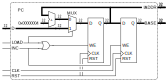
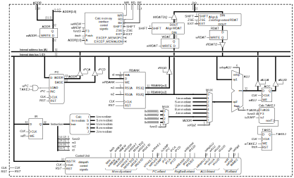
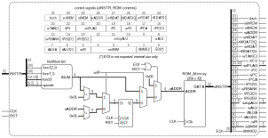

# nanoRISCV-mc-2db short description
Simplified, unoptimized, multi-cycle RISC-V RV32I in SystemC + Qt using two internal data buses for educational purposes.

# Intro
The idea is to develop a graphical interactive simulation of a minimal computer system based on a RV32I CPU (single hart) with no additional extensions.
The goal is to use MUXes, tristage gates, registers, and latches in the design so it can be used for educational purposes.
An additional educational goal is to add to the simulation the possibility to force the user (aka the student) to determine the value of the control unit signals to execute specific, already-included (in the TV32I ISA) instructions
or enhance the ISA with new instructions (unused opcodes in the RV32I ISA); to this extent the Control Unit is ROM-based and the ROM is editable by the user at runtime.

# Overall hardware structure
The architecture of the system is Von-Neumann. 
The system contains a single memory block containing instructions and data starting at address zero.
Peripherals are memory-mapped starting at address 0x80000000.
The CPU main features:
* It's multi-cycle, ie. the execution of each instruction requires multiple clock cycles,
* It's a non-pipelined design, ie. the CPU doesn't execute an instruction until the previous one is finished,
* Supports RV32I instructions only, without priviledge instructions, exceptions, traps, or interrupts,
* Doesn't support unaligned memory accesses although all properly aligned byte, half, and word accesses are supported.
* All edge-triggered writes are controlled by a WE (write enable) input connected to a control signal. The write operation is actually performed at the end of the clock cycle (falling-edge).

The timing of the different elements is as follows:

1. Except for the operations explicitly listed here, the time required to perform an operation is almost zero, and any number of these operations performed one after the other also requires a negligible amount of time.
1. For the operations explicitly listed here, the term "N clock cycle(s)" actually means _almost_ "N clock cycle(s)". This means that a single operation requiring "N clock cycles(s)" can be successfully combined in-series with any number of negligible-time operations in exactly N clock cycle(s). 
   * Example: An ALU operation takes "1 clock cycle". This actually means that, in the same clock cycle, the CPU can
      * a) Read operands and dump the values onto the internal data buses (zero time operations), 
      * b) then perform the ALU operation (1 clock cycle), 
      * c) followed by dumping the ALU result onto the internal address bus (zero time operation), and 
      * d) writing this value into the ADDR register (zero time operation).
1. Any operation performed by the ALU requires 1 clock cycle.
   1. During this clock cycle the ALU inputs (values dumped onto both internal data buses and the operation selection) must be stable.
   1. During the last part of the clock cycle the ALU puts the calculated value onto the result output.
1. The external memory operations (either read or write) take exactly two clock cycles. 
   1. For write operations, during this two clock cycles the inputs to the external memory (address, rd, wr, be, and dq) must be stable.
   1. For read operations, during this two clock cycles the inputs to the external memory (address, rd, wr, and be) must be stable.
   1. For read operations, during the last part ff the second clock cycle the external memory dumps the read value onto the dq bus.

The image above shows the overall system structure that contains:
* A RISC-V RV32I CPU (bottom).
* A memory address decoder (center). A very simple memory decoding is used.
* A 64K x 32 memory containing instructions and data (right-center). The behavior of this memory block mimics a standard SRAM memory. Its contents are initialized with the executable in intel-hex format.
* A 16K x 32 peripheral I/O area (right-top). The project currently doesn't include any peripherals.

### Memory map
The system has a simple memory map:
* 0x00000000 to 0x0003FFFF: Instruction + data memory (256KB total, 64K positions x 32-bit words memory block).
* 0x00040000 to 0x7FFFFFFF: Unpopulated.
* 0x80000000 to 0x80003FFF: Peripherals, 16KB total, 4K positions x 32-bit words  TBD.
* 0x80004000 to 0xFFFFFFFF: Unpopulated.

## CPU structure

The CPU structure is depicted below

with the components:
1. WADDR. A 32-bit transparent latch that holds the address used in transactions with the external memory.
1. WDAT. A 32-bit transparent latch that holds the value to be written in a write operation with the external memory.
1. RDAT. A 32-bit transparent latch that holds the value read from the external memory in a read operation.
1. PC. Program Counter block. This component exports two outputs: the 32-bit PC value (called IADDR) to be used as the memory address for the instruction fetch and the base value (called BASE) to be used in the calculation of the target address in PC-relative jumps.
1. RBANK. The CPU Register Bank or Register File. A set of 32 32-bits registers; register R0 resets to zero and can't be overwritten (any write attempt is silently discarded). Two read ports RS1 and RS2 allows reading two values simultaneously.
1. ALU. The CPU 32-bit Arithmetic-Logic Unit. From the operands in the data buses and the operation selection the ALU performs a calculation and determines the value of the Z, N, and C flags.
1. ACC. The 32-bit Accumulator register. Holds the result of the ALU.
1. IR. The 32-bit Instruction Register. Holds the instruction bits fetched from the external memory.
1. Immediate block. A combinational block that extracts any of the immediate values present in the IR.
1. Op2 block. A MUX that selects among RBANK[rs2] and one of the possible immediate values to be the second operand of the ALU.
1. The Control Unit (CU). This block generates all control signals to control the CPU datapath. It is composed of:
   1. The main control unit block, where the majority of control signals are generated.
   1. The memory interface. This is part of the Control Unit but exposed outside the CU block. A circuitry that generates external control signals for the memory transaction, and CPU-internal signals to support byte, half, and word aligned accesses.
   1. The TAKEJ block. This is part of the Control Unit but exposed outside the CU block. A circuitry that determines if, as the result of a comparison performed in the ALU (with its corresponding flags), a jump has to be taken or not. In the end this information is stored into the TAKEJ flag; this single-bit flag will allow or deny, in a future clock cycle, loading the PC with the calculated target address.

The execution of any instruction is divided into two distinct phases, each one requiring several clock cycles:
* The initial fetch phase. Common to all instruction, the goal of this phase is to fetch (read) the instruction bits from the external memory. This phase ends when the IR is written.
* The second execution phase. This is different for each instruction, and its goal is to finish the execution of the instruction. This comprises one or more of these steps: operands retrieval, ALU calculation, memory operation, and result write. This phase ends when the CU-internal control signal EOI (End-Of-Instruction) is asserted in which case the next clock cycle is the first one of the fetch phase of the next instruction.

### Program Counter (PC) structure

Inputs:
* D is the 32-bit target address when taking a jump during the execution of a jump/branch instruction.
* LOAD is a 1-bit input that enables loading the D value into the ADDR register.
* INC is a 1-bit input that enables writing PC+4 into the ADDR register and, at the same time, write PC into the BASE register.
* RST is a 1-bit input that resets (clears) to zero both ADDR and BASE registers.
Outputs:
* IADDR is the 32-bit address for the instruction fetch. It corresponds to the address of the current instruction during the fetch phase, and the address of the immediately posterior one after the fetch phase.
* BASE is the 32-bit address for PC-relative calculations. It corresponds to the address of the previously executed instruction during the fetch (irrelevant for the execution of the current one) and to the address of the current one after the fetch phase.

### Memory interface

The CPU memory interface is divided into three separate sections (see below)
 

1. The circuitry used to generate the external memory interface signals RD, WR, and BE and the internal signals SHIFT, ZSE, and EXT used to align and zero/sign extend the values in read and write operations. This is shown on the left in the image above.
   * Inputs:
      * wrMEM. 1 bit. Signals a memory write operation. This signal must be asserted all the clock cycles the write operation is ongoing.
      * rdMEM. 1 bit. Signals a memory read operation. This signal must be asserted all the clock cycles the read operation is ongoing.
	  * FETCH. 1 bit. Used in combination with rdMEM. Signals the fetch phase during the execution of any instruction and helps the memory interface to determine if the read operation is a 32-bit aligned word read irrespective of F3 and A.
	  * F3. 3-bits. The funct3 field of the RV32I instrucion.
	  * A. 2-bit. The two LSB bits of the memory address.
   * Outputs:
      * WR. 1 bit. External memory write.
      * RD. 1 bit. External memory read.
	  * BE. 4 bits. Individual byte enables in the 32-bit external data bus.
	  * SHIFT. 2 bits. Number of bytes to shift in the alignment process between the CPU and the external DQ bus.
	  * ZSE. 1 bit. Zero/Sign Extend. Indicates whether the extension (if any) to 32-bits of the data read from external memory must be a zero-extension (ZSE = 0) or a sign-extension (ZSE = 1).
	  * EXT. 2 bits. Size of the extension to be performed in a read operation: 0 = no extension (word access), 1 = 16-bit extension (half access), 2 = 24-bit extension (byte access).
1. The WDAT alignment circuitry, that aligns the value to be written into memory to the BEs used in the transaction. This is shown on the center in the image above.
   * Inputs:
	  * SHIFT. 2 bits. Number of bytes to shift in the alignment process between the CPU and the external DQ bus.
      * DIN. 32 bits. Data from CPU, to be written into external memory.
   * Outputs:
      * DOUT. 32 bits. Aligned data to be actually written into the external memory.
1. The RDAT alignment and zero/sign extension circuitry. This first aligns the value coming from the external memory in a read operation and then zero/sign extend the resulting value to 32 bits if the operation is a byte or half read operation. This is shown on the right in the image above.
   * Inputs:
      * DIN. 32 bits. Data coming from the external memory in a read operation.
	  * SHIFT. 2 bits. Number of bytes to shift in the alignment process between the CPU and the external DQ bus.
	  * ZSE. 1 bit. Zero/Sign Extend. Indicates whether the extension (if any) to 32-bits of the data read from external memory must be a zero-extension (ZSE = 0) or a sign-extension (ZSE = 1).
	  * EXT. 2 bits. Size of the extension to be performed in a read operation: 0 = no extension (word access), 1 = 16-bit extension (half access), 2 = 24-bit extension (byte access).
   * Outputs:
      * DOUT. 32 bits. Aligned data to be actually stored into the CPU.

### Control Unit structure

The Control Unit is built around a 256 x 32 ROM memory that contains the value of the datapath control signals for all clock cycles of all instructions. One position of the ROM table corresponds to one clock cycle in the instruction execution.

Each ROM memory position is called a uINSTR (micro-instrucion), and the value used to address the ROM memory is called uADDR (micro-address).
The ROM accepts an address value (the uADDR value) in one clock cycle and provides the contents at that address in the next clock cycle in the data output.

ROM contents is divided into "sections" of 4 positions each, that corresponds to 4 clock cycles during the instruction execution.
The first section, at address zero, is reserved for the fetch phase. At the end of the fecth phase the section used is determined by the INUM value, coming from the Instruction Number circuitry (InstrNum). We're assuming here that the fetch phase requires no more than four clock cycles and that there are no instruction that requires, after the fetch phase, more than four clock cycles to finish the execution. This can be easily changed, however, changing the INUM assigned to each instruction, as the execution finishes only when a position contains an asserted EOI bit.

At the beginning of the fetch phase uADDR = 0; then it is increased in each clock cycle except that:
1. If the wRI signal (one of the uINSTR bits coming from the ROM) is asserted then uADDR = INUM, the result of the Intruction Number block.
1. If the EOI signal (one of the uINSTR bits coming from the ROM) is asserted then uADDR = 0, the result of the Intruction Number block.

Inputs:
* INSTR is the 32-bit instruction being fetched (the D input of the IR, not its Q output).
* RST is a 1-bit input that resets (clears) to zero the uADDR register.
Outputs:
* IADDR is the 32-bit address for the instruction fetch. It corresponds to the address of the current instruction during the fetch phase, and the address of the immediately posterior one after the fetch phase.
* BASE is the 32-bit address for PC-relative calculations. It corresponds to the address of the previously executed instruction during the fetch (irrelevant for the execution of the current one) and to the address of the current one after the fetch phase.

### List of control signals

Control signals, in general, follow the nomenclature *op*ELEM or *op*FROMTO:
- *op* is a prefix stating the operation performed by the control signal, always lowercase:
   - *t* means controlling a tristate gate to dump a value onto a bus.
   - *w* or *wr* means writing into an storage element (either register or transparent latch). Currently, *wr* prefix is reserved for writes onto the external memory, all write control signals for CPU-internal storage elements use the *w* prefix.
   - *rd* means reading from a storage element. Currently, applied only the external memory.
   - *i* means increment.  Currently, applied only the Program Counter (PC).
- ELEM is the name of the element, eg. RBANK is the Register Bank, PC is the Program Counter
- FROMTO is a composed name. FROM is always the name of the source element, TO is the name of the destination element or bus. For example, tRB1D is the tristate control signal that connects the output of the register bank read output 1 (RB1) and the data bus 1 (D).

Apart from the signals for the external memory interface, the CPU receives only two signals:
1. RST. High-level asynchronous reset input. This input is asserted high at the beginning of the simulation to initialize the internal elements of the CPU.
1. CLK. The CPU clock. A clock cycle is defined as the time elapsed between a CLK rising edge and the subsequent falling edge. All writes into edge-triggered storage elements occur at the end of the clock cycle (on the falling edge).

All control signals are high-level active and active for an integral number of clock cycles. 
Those signals enabling the write into edge-triggered storage elements (registers, register bank) are actually write enables (WE) signals synchronous to the clock, and the write is actually performed at the end of the clock cycle, at the negative edge of the clock.

The complete list of control signals are:
1. Memory-related control signals:
   1. fetch. Signals that the fetch phase is ongoing. It is asserted in the first clock cycle of the execution of any instruction and it remains asserted until the last clock cycle of the fetch phase, when the IR (Instruction Register) is written with the instruction bits.
   1. wrMEM. Write into external memory.
   1. rdMEM. Read from external memory.
   1. wADDR. Write into the ADDR latch. This contains the external memory address.
   1. wWDAT. Write into the WDAT latch. This contains the value to be written into external memory.
   1. tWDATDQ. Dump (through a tristate gate) the WDAT latch onto the external DQ data bus.
   1. wRDAT. Write into the RDAT latch. This contains the value read from external memory.
   1. tRDATD. Dump (through a tristate gate) the RDAT latch onto the internal D data bus.
1. PC-related control signals:
   1. wTAKEJ. Write the TAKEJ ("take jump") flag. The TAKEJ flag determines if a branch/jump must be taken and it is cleared at the fetch phase of every instruction. This is 1 for JAL/JALR but may be 0 or 1 for branches, depending whether the branch condition (extracted from funct3 instruction field) is met or not.  For branch instructions the wTAKEJ control signal must be asserted in the clock cycle the ALU is performing the comparison (to use the flags that result from the comparison) and before the wPC signal is asserted; for unconditional jumps (JAL/JALR) this signal must be asserted in combination with isJUMP, prior to asserting wPC.
   1. isJUMP (is-JUMP instruction). Indicates the instruction is an unconditional jump (JAL, JALR).
   1. iPC (increment PC). Increment the PC value.
   1. wPC (write PC). Write the jump target address into the PC register (only if the TAKEJ allows the operation).
   1. tPCA. Dump (through a tristate gate) the PC register (the instruction address) onto the internal address data bus.
   1. tPCD. Dump (through a tristate gate) the PC register (the base address for PC-relative jumps) onto the internal D data bus.
1. RegisterBank-related control signals:
   1. wRBANK. Write the value of the internal D data bus into the rd register of the register bank.
   1. tRS1D. Dump (through a tristate gate) the value of the rs1 register of the register bank onto the internal D data bus.
   ALU-related control signals:
   1. selALUop (4 bits). Selection of the operation to be performed by the ALU. See the ALU section for details.
   1. wALU. Write the ALU result into the ACC (accumulator) register and also update the stored ALU flags.
   1. tALUA. Dump (through a tristate gate) the value of the ALU result (before the ACC register) onto the internal A address bus.
   1. tALUD. Dump (through a tristate gate) the value of the ACC register onto the internal D data bus.
1. IR-related control signals:
   1. wIR. Write the instruction bits into the Instruction Register (IR).
   1. selOp2 (3 bits). Selection of the immediate value from the I, S, U, B, and J immediates coming from the different instructions format.
   Control signals internal to the Control Unit:
   1. EOI (End-Of-Instruction). This control signal is internal to the Control Unit. It signals the last clock cycle of the execution of the current instruction.

  
### CPU design decisions
Several questionable design decisions have been made, some of them to add clarity to the design, some others simply to add a variety of elements in the design (which is important so the user/student can analyze different kinds of elements), simplify the overall block diagram or educational purposes:
- An internal address bus using tristate gates have been used. The ADDR input may come from the PC or the ALU output. A 2-input MUX could replace this bus.
- An internal data bus using tristate gates have been used as the "main" data transfer element. Possible sources are PC, RBANK[rs1], ALU output, and RDAT; possible destinations are PC, RBANK[rd], and ALU 1st operand. A 4-input MUX could replace this bus.
- A large 8-input MUX have been used to select among RBANK[rs2], I-immediate, S-immediate, U-immediate, B-immediate, J-immediate, 0x00000000, and a value based on the 2-bit LSBs of funct3 instruction field (0x00000001 for bytes, 0x00000002 for halfs, 0x00000004 for words, 0x00000001 for funct3[2:0] = 11 binary). In this case the MUX is used to reduce the number of control signals that would be required if using a tristate gate for each of these possible sources.
- The storage elements that connect the CPU with the external memory are built using transparent latches, all the other storage elements of the CPU are edge-triggered registers. Although this reduces the number of clock cycles required to perform some operations, the rationale behind this decision is just to add variety to the CPU internal storage elements.
- The PC register exhibits two outputs: instruction address and base. The instruction address output is the memory address used for the fetch phase to retrieve the instruction bits and the base output is the value used for PC-relative address calculations in the ALU. The address of the current instruction is the instruction address at the beginning of the execution until the PC is incremented, then it moves to the base output; ie. the instruction address is the address of the current instruction up to the clock cycle the iPC control signal is asserted and the address of the immediately following instruction after that; on the other hand the base output is the address of the previous executed instruction before and up iPC and the address of the current one after that point. The rationale behind this is to assert iPC blindly during the fetch phase for all instructions, even jump/branch instructions that use PC-relative (relative to the PC of the jump/branch instruction itself) calculations to determine the target instruction address.
- The external memory interface uses a 32-bit bidirectional DQ data bus, a 30-bit ADDR bus plus 4-bit BE (byte enables) to indicate word address and bytes inside the word that are related to the memory operation, and separate RD and WR signals. Taking into account the presence of the BE signals (that are 0 when no memory operation is ongoing), a single WR signal would suffice to signal a write operation (WR = 1) or a read one (WR = 0); this was finally discarded to improve the clarity of the memory interface.

TO DISCUSS:
- The execution time of conditional branches could be reduced if the branch is not taken, simply by connecting the output value (inverted) of the CalcTAKEJ component as a third input to the 2-input OR logic gate in the Control Unit component that controls the MUX that provides uADDR to the ROM table. The effect of this connection would be that, if the calculated Take Jump bit = 0, its inverted value would force uADDR = 0 and that would abort the branch execution, starting the execution of instruction immediately following the branch in the next clock cycle. Another effect of this connection is that branch instructions would have two different execution times: a shorter one if the branch condition doesn't hold and the jump is not taken, and a larger one if the branch condition holds and the jump is taken. Even if this means the design becomes more efficient in terms of clock cycles, this "variable" execution time was considered an obstacle for the student understaning and so was discarded. 

# Software development
Software development for this system is based on the use of a standard RV32I assembler that generates an intel-hex file from the final executable. This intel-hex file is loaded by the Qt program to fill the external memory before the simulation starts.

# How to simulate
I don't know yet :(
