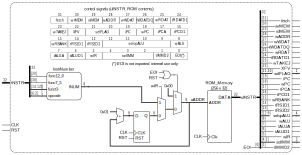

# nanoRISCV-mc-2db short description
Simplified, unoptimized, multi-cycle RISC-V RV32I in SystemC + Qt using two internal data buses for educational purposes.

# Intro
The idea is to develop a graphical interactive simulation of a minimal computer system based on a RV32I CPU (single hart) with no additional extensions.
The goal is to use MUXes, tristage gates, registers, and latches in the design so it can be used for educational purposes.
An additional educational goal is to add to the simulation the possibility to force the user (aka the student) to determine the value of the control unit signals to execute specific, already-included (in the TV32I ISA) instructions
or enhance the ISA with new instructions (unused opcodes in the RV32I ISA); to this extent the Control Unit is ROM-based and the ROM is editable by the user at runtime.

# Overall hardware structure
The architecture of the system is Von-Neumann. 
The system contains a single memory block containing instructions and data starting at address zero.
Peripherals are memory-mapped starting at address 0x80000000.
The CPU main features:
- It's multi-cycle, ie. the execution of each instruction requires multiple clock cycles,
- It's a non-pipeline design, ie. a CPU doesn't execute an instruction until the previous one is finished,
- Supports RV32I instructions only, without priviledge instruction, exceptions, traps, or interrupts,
- Doesn't support unaligned memory accesses although all properly aligned byte, half, and word accesses are supported.
- All edge-triggered writes are controlled by a WE (write enable) input connected to a control signal. The write operation is actually performed at the end of the clock cycle.

The timing of the different elements is as follows:
1. Except for the operations explicitly listed here, the time required to perform an operation is almost zero, and any number of these operations performed one after the other also requires a negligible amount of time.
2. For the operations explicitly listed here, the term "N clock cycle(s)" actually means _almost_ "N clock cycle(s)". This means that a single operation requiring "N clock cycles(s)" can be successfully combined in-series with any number of negligible-time operations in exactly N clock cycle(s). 
- Example: An ALU operation takes "1 clock cycle". This actually means that, in the same clock cycle, the CPU can
  - a) Read operands and dump the values onto the internal data buses (zero time operations), 
  - b) then perform the ALU operation (1 clock cycle), 
  - c) followed by dumping the ALU result onto the internal address bus (zero time operation), and 
  - d) writing this value into the ADDR register (zero time operation).
3. Any operation performed by the ALU requires 1 clock cycle.
  1. During this clock cycle the ALU inputs (values dumped onto both internal data buses and the operation selection) must be stable.
  2. During the last part of the clock cycle the ALU puts the calculated value onto the result output.
4. The external memory operations (either read or write) take exactly two clock cycles. 
  1. For write operations, during this two clock cycles the inputs to the external memory (address, rd, wr, be, and dq) must be stable.
  2. For read operations, during this two clock cycles the inputs to the external memory (address, rd, wr, and be) must be stable.
  3. For read operations, during the last part ff the second clock cycle the external memory dumps the read value onto the dq bus.

## List of control signals

Control signals, in general, follow the nomenclature *op*ELEM or *op*FROMTO:
- *op* is a prefix stating the operation performed by the control signal, always lowercase:
  - *t* means controlling a tristate gate to dump a value onto a bus.
  - *w* or *wr* means writing into an storage element (either register or transparent latch). Currently, *wr* prefix is reserved for writes onto the external memory, all write control signals for CPU-internal storage elements use the *w* prefix.
  - *rd* means reading from a storage element. Currently, applied only the external memory.
  - *i* means increment.  Currently, applied only the Program Counter (PC).
- ELEM is the name of the element, eg. RBANK is the Register Bank, PC is the Program Counter
- FROMTO is a composed name. FROM is always the name of the source element, TO is the name of the destination element or bus. For example, tRB1D1 is the tristate control signal that connects the output of the register bank read output 1 (RB1) and the data bus 1 (D1).

Apart from the signals for the external memory interface, the CPU receives only two signals:
1. RST. High-level asynchronous reset input. This input is asserted high at the beginning of the simulation to initialize the internal elements of the CPU.
2. CLK. The CPU clock. A clock cycle is defined as the time elapsed between a CLK rising edge and the subsequent falling edge. All writes into edge-triggered storage elements occur at the end of the clock cycle (on the falling edge).

All control signals are high-level active and active for an integral number of clock cycles. 
Those signals enabling the write into edge-triggered storage elements (registers, register bank) are actually write enables (WE) signals synchronous to the clock, and the write is actually performed at the end of the clock cycle, at the negative edge of the clock.

The complete list of control signals are:
1. Memory-related control signals:
  1. fetch. Signals that the fetch phase is ongoing. It is asserted in the first clock cycle of the execution of any instruction and it remains asserted until the last clock cycle of the fetch phase, when the IR (Instruction Register) is written with the instruction bits.
  2. wrMEM. Write into external memory.
  3. rdMEM. Read from external memory.
  4. wADDR. Write into the ADDR latch. This contains the external memory address.
  5. wWDAT. Write into the WDAT latch. This contains the value to be written into external memory.
  6. tWDATDQ. Dump (through a tristate gate) the WDAT latch onto the external DQ data bus.
  7. wRDAT. Write into the RDAT latch. This contains the value read from external memory.
  8. tRDATD1. Dump (through a tristate gate) the RDAT latch onto the internal D1 data bus.
2. PC-related control signals:
  1. wTAKEJ. Write the TAKEJ ("take jump") flag. The TAKEJ flag determines if a jump must be taken and it is cleared at the fetch phase of every instruction. This is 1 for jump/call but may be 0 or 1 for brnaches, depending whether the selected flag (selFLAG) value equals the expected value (XFV) or not. For branch instructions the wTAKEJ control signal must be asserted in the clock cycle the ALU is performing the comparison (to use the flags that result from the comparison) and before the wPC signal is asserted; for unconditional jumps (selFLAG = 0) this signal may be asserted in any clock cycle prior to the assertion of wPC.
  2. XFV (eXpected-Flag-Value). The value of the selected ALU flag (using selFLAG) used to determine whether the jump is taken or not must match the value of this control signal for the jump to be taken.
  3. selFLAG (2 bits). Selects the ALU flag to compare against XFV to decide if the jump is taken or not. 
    1. selFLAG = 0. No ALU flags used (unconditional jump).
    2. selFLAG = 1. The Z ALU flag is used (conditional branch BEQ/BNE). Jump taken if Z == XFV.
    3. selFLAG = 2. The N ALU flag is used (conditional branch BLT/BGE). Jump taken if N == XFV.
    4. selFLAG = 3. The C ALU flag is used (conditional branch BLTU/BGEU). Jump taken if C == XFV.
  4. iPC (increment PC). Increment the PC value.
  5. wPC (write PC). Write the jump target address into the PC register (only of the TAKEJ allows the operation).
  6. tPCA. Dump (through a tristate gate) the PC register (the instruction address) onto the internal address data bus.
  7. tPCD1. Dump (through a tristate gate) the PC register (the base address for PC-relative jumps) onto the internal D1 data bus.
3. RegisterBank-related control signals:
  1. wRBANK. Write the value of the internal D1 data bus into the rd register of the register bank.
  2. tRS1D1. Dump (through a tristate gate) the value of the rs1 register of the register bank onto the internal D1 data bus.
  3. tRS2D2. Dump (through a tristate gate) the value of the rs2 register of the register bank onto the internal D2 data bus.
4. ALU-related control signals:
  1. selopALU (4 bits). Selection of the operation to be performed by the ALU. See the ALU section for details.
  2. wALU. Write the ALU result into the ACC (accumulator) register and also update the stored ALU flags.
  3. tALUA. Dump (through a tristate gate) the value of the ALU result (before the ACC register) onto the internal A address bus.
  4. tALUD1. Dump (through a tristate gate) the value of the ACC register onto the internal D1 data bus.
5. IR-related control signals:
  1. wIR. Write the instruction bits into the Instruction Register (IR).
  2. selIMM (3 bits). Selection of the immediate value from the I, S, U, B, and J immediates coming from the different instructions format.
  3. tIMMD2. Dump (through a tristate gate) the value of the selected immediate value onto the internal D2 data bus.
6. Control signals internal to the Control Unit:
  1. EOI (End-Of-Instruction). This control signal is internal to the Control Unit. It signals the last clock cycle of the execution of the current instruction.
  
## Design decisions
Several questionable design decisions have been made, some of them to add clarity to the design, some others simply to add a variety of elements in the design (which is important so the user/student can analyze different kinds of elements), simplify the overall block diagram or educational purposes:
- Two data buses internal to the CPU have been used, one for each operand inputs of the ALU, called "internal data bus 1" (D1) and "internal data bus 2" (D2).
- A MUX + tristate have been used to dump the immediate value (I, S, U, B, or J) to D2 and a separate tristate (with a separate control signal) to dump the value of the second read port of the register bank (RB2) to the same D2 bus. The first MUX has 5 entries (3 selection bits), so integrating RB2 as a 6th one would reduce the number of control signals (the tRB2D2 control signal).
- Four separate tristate gates (with their corresponding control signals) have been used to dump the value of PC, RB1, RDAT, and ALU onto the D1 data bus. Using a 4-to-1 MUX would require only two selection bits, eliminating 2 control signals.
- Two separate tristate gates (with their corresponding control signals) have been used to dump the value of PC and ALU onto the internal address bus. Using a 2-to-1 MUX would require only one selection bit, eliminating 1 control signal.
- The storage elements that connect the CPU with the external memory are built using transparent latches, all the other storage elements of the CPU are edge-triggered registers. Although this reduces the number of clock cycles required to perform some operations, the rationale behind this decision is just to add variety to the CPU internal storage elements.
- The PC register exhibits two outputs: instruction address and base. The instruction address output is the memory address used for the fetch phase to retrieve the instruction bits and the base output is the value used for PC-relative address calculations in the ALU. The address of the current instruction is the instruction address at the beginning of the execution until the PC is incremented, then it moves to the base output; ie. the instruction address is the address of the current instruction up to the clock cycle the iPC control signal is asserted and the address of the immediately following instruction after that; on the other hand the base output is the address of the previous executed instruction before and up iPC and the address of the current one after that point. The rationale behind this is to assert iPC blindly during the fetch phase for all instructions, even jump/branch instructions that use PC-relative (relative to the PC of the jump/branch instruction itself) calculations to determine the target instruction address.
- The external memory interface uses a 32-bit bidirectional DQ data bus, a 30-bit ADDR bus plus 4-bit BE (byte enables) to indicate word address and bytes inside the word that are related to the memory operation, and separate RD and WR signals. Taking into account the presence
of the BE signals (that are 0 when no memory operation is ongoing), a single WR signal would suffice to signal a write operation (WR = 1) or a read one (WR = 0); this was finally discarded to improve the clarity of the memory interface.

## Memory map
The system has a simple memory map:
- 0x00000000 to 0x0003FFFF: Instruction + data memory (256KB total, 64K positions x 32-bit words memory block)
- 0x00040000 to 0x7FFFFFFF: Unpopulated
- 0x80000000 to 0x80003FFF: Peripherals, 16KB total, 4K positions x 32-bit words  TBD.
- 0x80004000 to 0xFFFFFFFF: Unpopulated

## CPU structure

The CPU structure is depicted below

with the components:
1. xxx
2. xxx
3. xxx
 

[imgCpu]: (doc/images/rv32i_mc_2db_cpu.svg) "CPU hardware structure"

### Memory interface

### Control Unit structure

# Software development
Software development for this system is based on the use of a standard RV32I assembler that generates an intel-hex file from the final executable.
The intel-hex file is loaded by the Qt program to fill the system memory.

# How to simulate
